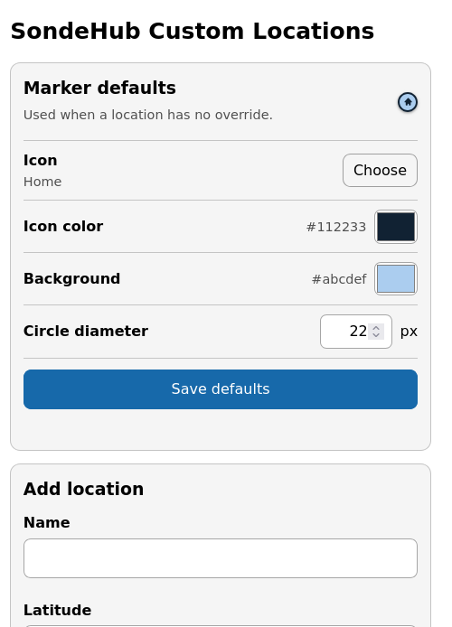
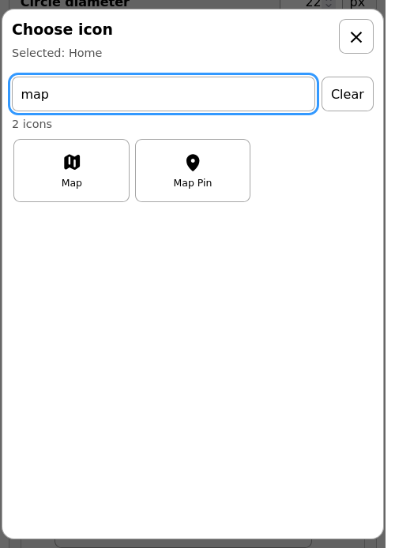
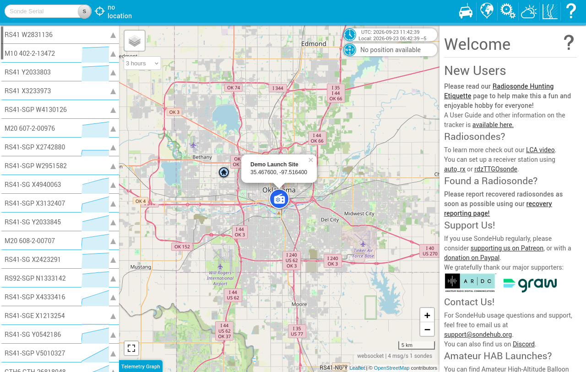

# SondeHub Custom Locations

A privacy-focused Firefox WebExtension that adds persistent personal markers to the public [SondeHub Tracker](https://tracker.sondehub.org/) and [SondeHub Amateur](https://amateur.sondehub.org/) maps.

This is an independent community project. It is not affiliated with, sponsored by, or endorsed by SondeHub.

- **Firefox desktop:** 140 or newer
- **Firefox for Android:** 142 or newer
- **Current version:** 1.6.4
- **License:** MIT
- **Status:** prepared for AMO submission; no Mozilla-signed public release yet

[](https://github.com/Mason10198/sondehub-custom-locations/actions/workflows/ci.yml)
[](LICENSE)

The extension has no project-operated backend, account, analytics, telemetry, remotely loaded resources, or direct network requests. Desktop locations use Firefox's browser-managed `storage.sync`; Firefox may send that data through the user's Firefox Sync account. Android uses the same API locally but does not synchronize extension data, so CSV backup and restore is provided for every platform.

## Contents

- [Features](#features)
- [Screenshots](#screenshots)
- [Install for development](#install-for-development)
- [Use the extension](#use-the-extension)
- [CSV import](#csv-import)
- [Build and verify](#build-and-verify)
- [Create a persistent signed release](#create-a-persistent-signed-release)
- [Firefox for Android](#firefox-for-android)
- [Troubleshooting](#troubleshooting)
- [Privacy and permissions](#privacy-and-permissions)
- [Privacy policy](PRIVACY.md)
- [Architecture and repository layout](#architecture-and-repository-layout)
- [Limitations](#limitations)
- [Contributing and security](#contributing-and-security)
- [Licensing and provenance](#licensing-and-provenance)

## Features

- Runs only on `tracker.sondehub.org`, `sondehub.org`, and `amateur.sondehub.org`.
- Draws markers in a private extension-origin overlay above the SondeHub map.
- Adds, edits, and deletes locations from a responsive options page.
- Synchronizes locations between desktop Firefox profiles signed in to the same Firefox account with extension syncing enabled.
- Exports and imports portable CSV backups on desktop and mobile.
- Provides synchronized defaults for icon, colors, and circle diameter.
- Lets individual markers override any appearance setting while inherited markers follow future default changes.
- Imports CSV files with required `name,lat,long` columns and optional appearance override columns in **add** or **replace all** mode.
- Reports skipped CSV rows with their source row number and validation error.
- Updates open SondeHub tabs immediately when locations change.
- Includes all 316 optimized Heroicons v2.2.0 Micro SVGs.
- Provides a responsive, searchable icon chooser with live previews and touch-friendly controls.
- Preserves legacy icon names and migrates previously stored larger Heroicons variants to the matching Micro icon.

## Screenshots

| Marker defaults on mobile | Searchable icon chooser |
| --- | --- |
|  |  |



## Install for development

There is not yet a Mozilla-signed public release. Use this temporary installation path to test the source on desktop Firefox.

### 1. Get and verify the source

Requirements: Git, Node.js 20 or newer, Python 3, and Firefox 140 or newer.

```sh
git clone https://github.com/Mason10198/sondehub-custom-locations.git
cd sondehub-custom-locations
npm ci
npm test
npm run lint
```

The project has no runtime npm dependencies. `npm ci` validates the committed lockfile.

### 2. Load it temporarily in Firefox

1. Open `about:debugging#/runtime/this-firefox`.
2. Select **Load Temporary Add-on…**.
3. Select this repository's `manifest.json`.
4. Open `about:addons`, find **SondeHub Custom Locations**, and select **Preferences**.

Temporary add-ons are removed when Firefox restarts. Saved extension storage may remain in the development profile, but temporary loading is not a persistent deployment method.

For an optional automatic desktop development loop, install current `web-ext` and run:

```sh
npx --yes web-ext@latest run --source-dir .
```

This launches a disposable Firefox development profile and is also temporary.

## Use the extension

1. Open the extension's **Preferences** page from `about:addons`.
2. Set the default marker icon, colors, and circle diameter if desired.
3. Enter a location name and decimal latitude and longitude. Enable only the appearance overrides that location needs.
4. Select **Save location**.
5. Open or return to a supported SondeHub map.
6. Use the **Custom markers** button on the map to show or hide the private overlay.

Marker names appear beside visible markers at closer zoom levels. The overlay is noninteractive so normal map dragging, zooming, and touch gestures continue to pass directly to SondeHub.

Editing or deleting a location updates supported SondeHub tabs without a reload. **Delete all** requires confirmation.

## CSV import

CSV files must have this header:

```csv
name,lat,long
```

Example:

```csv
name,lat,long,icon,icon_color,background_color,marker_diameter
Home,40.7128,-74.0060,,,,
Launch site,34.0522,-118.2437,rocket-launch,#ffffff,#2563eb,40
"Field, west",51.5074,-0.1278,landing,#000000,#facc15,
```

A complete sample is available at [`examples/locations.csv`](examples/locations.csv).

Import behavior:

- **Add:** appends valid imported locations to the saved list.
- **Replace all:** replaces the saved list with valid imported locations.
- Header names are case-insensitive. The only required columns are `name`, `lat`, and `long`; `icon`, `icon_color`, `background_color`, and `marker_diameter` are optional overrides, and other extra columns are ignored.
- Invalid rows are skipped and reported; valid rows in the same file still import.
- Latitude must be from `-90` to `90`; longitude must be from `-180` to `180`.
- Names are trimmed, required, and limited to 120 characters.
- UTF-8 files with an optional byte-order mark are supported.
- Standard quoted CSV fields, commas inside quoted names, escaped quotes, CRLF, and quoted multiline fields are supported.
- Canonical icon keys use `16-solid/name`, such as `16-solid/map-pin` or `16-solid/home`.
- Legacy keys such as `pin`, `home`, `launch`, `landing`, and `radio` remain supported.
- Missing or blank icon values inherit the synchronized default icon and follow later default-icon changes. A nonblank icon is stored as a per-location override. Unknown nonblank icon values retain backward-compatible Map pin fallback behavior.
- Colors must be six-digit hexadecimal values such as `#ffffff` or `#2563eb`.
- A nonblank imported color is stored as a per-location override, even when it equals the current default.
- Missing or blank colors inherit the synchronized default colors and follow later default changes.
- Rows containing a nonblank invalid color are skipped and reported.
- Marker diameter is a whole number from `20` to `64` pixels, with a `22` pixel default. Missing or blank values inherit the synchronized default diameter.
- **Export CSV backup** writes every saved location, appearance override, coordinate, and synchronized default appearance to a portable CSV file. Inherited appearance cells remain blank so inheritance survives a round trip.
- Importing an extension-generated backup restores its default appearance as well as its locations.
- Exported CSV files can be imported on desktop or Android in either add or replace mode.
- CSV backups intentionally create new internal IDs when imported; display data is preserved.
- Exports include a `sondehub_csv_version` column and safely prefix spreadsheet-formula-leading names; re-import removes only that export escape and restores the exact name.

## Build and verify

### Requirements

- Node.js 20 or newer
- Python 3

### Complete local verification

```sh
npm ci
npm run verify:vendor
npm run generate:icons
npm test
npm run lint
npm run package
npm run verify:package
npm run verify:source
python3 -m zipfile -t dist/sondehub-custom-locations-1.6.4.xpi
npx --yes web-ext@latest lint --source-dir . \
  --ignore-files scripts/package.py scripts/verify-package.py scripts/package-source.py scripts/verify-source.py
```

What these commands do:

- `npm run verify:vendor` verifies the pinned Heroicons revision hashes, license hash, file types, and safe SVG boundary.
- `npm run generate:icons` deterministically regenerates `src/shared/icons.js` from the vendored SVG files.
- `npm test` runs the catalog, CSV, validation, protocol, storage, and map-adapter tests.
- `npm run lint` checks the manifest, generated catalog, third-party provenance, runtime network-API prohibition, local-only options page, required assets, and JavaScript syntax.
- `npm run package` creates `dist/sondehub-custom-locations-<version>.xpi`.
- `npm run verify:package` builds the XPI twice, compares SHA-256 hashes, checks ZIP integrity and duplicate paths, and verifies the runtime-only allowlist and required licenses.
- `npm run verify:source` creates the Mozilla reviewer source archive, extracts it into a clean temporary directory, reruns vendor generation and tests, and reproduces a byte-identical XPI.
- `web-ext lint` applies Mozilla's current add-on validation rules.

`src/shared/icons.js` is generated. Do not edit it manually.

### Packaging properties

The packaging script:

- Reads the version from `manifest.json`.
- Includes only 15 allowlisted runtime and license files. The 316 source SVGs stay in the repository for provenance checks but are not duplicated in the XPI because the generated local catalog already contains them.
- Refuses symlinks and special files.
- Sorts archive paths and uses fixed ZIP timestamps for deterministic output.
- Produces an **unsigned** XPI. Renaming or building an XPI does not sign it.

The package is byte-identical across two builds in the same verified environment. Cross-platform byte identity can depend on the Python and zlib implementations, so release receipts should record the exact environment and published SHA-256 rather than assuming every toolchain produces identical compressed bytes.

## Create a persistent signed release

Firefox Release and Beta require Mozilla-signed add-ons. Choose one of Mozilla's supported distribution paths:

- **Listed on AMO:** submit the XPI through the [AMO Developer Hub](https://addons.mozilla.org/developers/) for a public listing and Mozilla distribution.
- **Self-distributed:** use Mozilla's unlisted signing workflow, then distribute the returned signed XPI yourself where the target Firefox platform permits it.

Recommended release procedure:

1. Update `manifest.json`, `package.json`, `package-lock.json`, and [`CHANGELOG.md`](CHANGELOG.md) to the same version.
2. Run every command in [Complete local verification](#complete-local-verification).
3. Commit the complete release source, documentation, and reviewer instructions, then create the annotated version tag on that exact commit.
4. Record the XPI and source-archive SHA-256 values and inspect the exact files that will be submitted.
5. Submit the XPI and reviewer source ZIP to AMO and complete the required listing, privacy, and compatibility information.
6. Test the Mozilla-signed artifact in clean desktop and physical Android Firefox installations.
7. Publish release notes and attach artifacts only when their filenames clearly identify whether they are signed, unsigned, or reviewer source.

The prepared listing and reviewer notes are in [`AMO_LISTING.md`](AMO_LISTING.md). Mozilla reviewer build instructions are in [`AMO_SOURCE_README.md`](AMO_SOURCE_README.md). The detailed pre-submission and post-signing checks are in [`PUBLISHING.md`](PUBLISHING.md), and the public privacy statement is in [`PRIVACY.md`](PRIVACY.md).

For a Mozilla-signed self-distributed desktop build, open `about:addons`, use the gear menu, choose **Install Add-on From File…**, and select the signed XPI. Standard Firefox Release and Beta do not normally install an unsigned XPI persistently.

The committed Gecko ID is stable and should not change after publishing. The manifest declares `browser_specific_settings.gecko.data_collection_permissions.required: ["none"]` because the developer does not collect or receive user data. Firefox Sync transport is controlled by Firefox and the user's Mozilla account, not by this extension or its developer.

Never commit AMO API credentials, signing keys, browser profiles, or real personal-location exports.

## Firefox for Android

### Temporary development installation

Requirements: Android Platform Tools (`adb`), a connected Android device or emulator, Firefox for Android with remote debugging enabled, and current `web-ext`.

```sh
adb devices
npx --yes web-ext@latest lint --source-dir . \
  --ignore-files scripts/package.py scripts/verify-package.py scripts/package-source.py scripts/verify-source.py
npx --yes web-ext@latest run \
  --source-dir . \
  --target firefox-android \
  --android-device DEVICE_SERIAL \
  --firefox-apk FIREFOX_PACKAGE_ID
```

Replace `DEVICE_SERIAL` with the value from `adb devices`. Replace `FIREFOX_PACKAGE_ID` with the installed Firefox package being tested. `web-ext` can also prompt for a connected device when `--android-device` is omitted.

Temporary Android installation is for an edit/test loop. The extension is removed when the browser restarts, so this path does not prove persistent installation or storage across a full restart.

### Persistent Android installation

Use a Mozilla-signed build. For normal users, publish a compatible listed add-on through AMO and install it through Firefox for Android's Add-ons Manager.

Mozilla also documents installing a **signed** self-distributed XPI from a file on Android after enabling Firefox's hidden **Install Extension from File** option. Follow Mozilla's current [self-distributed installation documentation](https://extensionworkshop.com/documentation/publish/install-self-distributed/) and do not use this route with the unsigned `dist/*.xpi` produced by this repository.

Firefox for Android Nightly also supports AMO custom collections for development and testing. Follow Mozilla's current [custom extension collections documentation](https://extensionworkshop.com/documentation/develop/developing-extensions-for-firefox-for-android/#testing-extension-collection) rather than assuming the same flow is available in Release or Beta.

Firefox for Android does not synchronize WebExtension `storage.sync` data. Use **Export CSV backup** on another device and import that file on Android, or export from Android and import it elsewhere.

On a real device, verify:

1. Options-page add, edit, import, and delete behavior.
2. Marker rendering and the **Custom locations** layer on each supported SondeHub host.
3. Live updates without reloading the map.
4. Full Firefox restart and storage persistence using the signed persistent installation.

## Troubleshooting

### A saved marker does not appear

- Confirm the tab is on `tracker.sondehub.org`, `sondehub.org`, or `amateur.sondehub.org`.
- Wait for the SondeHub Leaflet map to finish loading.
- Check the map's layer control for **Custom locations**. If the site does not expose a layer selector, the extension still attempts to add its layer directly.
- Open the options page and confirm the location has valid decimal coordinates.
- Reload the temporary add-on in `about:debugging`, then reload the map tab.
- The extension stores and renders at most 250 locations. It also checks Firefox Sync's per-item and total byte quotas before writing, so unusually large migrated records or long escaped names may reach the storage limit sooner.

### Changes do not update an open map

- Confirm the map tab was already open on a supported URL and finished initializing.
- Reload the map tab once to recover from a SondeHub page update or failed initialization.
- Check that the extension is enabled in `about:addons`. Temporary add-ons disappear after Firefox restarts.

### CSV import fails or skips rows

- Confirm the file includes `name,lat,long` headers. Optional overrides use `icon,icon_color,background_color,marker_diameter`.
- Confirm any supplied colors are six-digit hexadecimal values beginning with `#`.
- Check latitude and longitude ranges and the 120-character name limit.
- Review the options-page skipped-row report; valid rows still import unless the CSV header or quoting is fatally invalid.
- Remember that **Replace all** intentionally replaces the existing saved list with the valid imported rows.

### Firefox refuses to install the XPI

- `npm run package` creates an unsigned development artifact.
- Use temporary loading for development or submit the artifact to Mozilla for signing before persistent installation.
- Make sure the Firefox version meets the desktop or Android minimum in `manifest.json`.

### Android device is not detected

- Run `adb devices`, unlock the device, and accept the USB-debugging prompt.
- Enable Firefox's remote USB debugging setting.
- Verify the `--android-device` serial and `--firefox-apk` package identify the connected device and installed Firefox channel.

## Privacy and permissions

- **API permission:** only `storage`, used for browser-managed desktop sync and local Android storage.
- **Page access:** one isolated content script matches only `tracker.sondehub.org`, `sondehub.org`, and `amateur.sondehub.org`; no separate `host_permissions` block is requested.
- No project backend, developer account system, analytics, telemetry, tracking, cloud database, CDN, external options-page links, remotely loaded resources, or direct extension network requests.
- On desktop, Firefox itself may transmit extension storage through the user's Firefox Sync account. The extension does not choose the server, hold credentials, or receive the data.
- Extension pages use a restrictive content security policy with `connect-src 'none'` and local-only scripts and styles.
- The AMO built-in consent declaration is `locationInfo` because saved coordinates can be transported by Firefox Sync. The developer does not receive that data.
- Default appearance and location records synchronize through the same browser-managed storage area.
- Deleting all locations removes location records but preserves the selected default icon, colors, and circle diameter.
- Firefox account, profile backup, Sync, clearing, and removal behavior remains controlled by Firefox.

### Supported-page boundary

Saved marker names, coordinates, icons, colors, and diameters remain inside extension contexts. An isolated content script reads only page-visible map geometry and sends that nonpersonal viewport state into a transparent extension-origin iframe. The iframe reads extension storage and draws the markers; same-origin protections prevent SondeHub page scripts from reading its marker DOM.

The page can detect, hide, or reposition the generic overlay iframe and toggle button because it owns the surrounding document. It does not receive stored marker values. The overlay never posts marker data back to the parent page.

## Architecture and repository layout

The extension avoids SondeHub's page JavaScript and uses two isolated components:

1. `src/content/map-overlay-host.js` runs as an isolated content script. It derives the current Web Mercator viewport from page-visible Leaflet tile geometry and hosts a generic transparent iframe. It never reads extension storage.
2. `src/overlay/overlay.html` is an extension-origin document. It privately reads validated `browser.storage.sync` records, projects coordinates into the supplied viewport, and renders a noninteractive marker layer that page scripts cannot inspect.

User-facing popup text is created with DOM text APIs. SVG is selected only from the generated, fixed Heroicons allowlist; CSV, storage, and page input cannot supply SVG markup.

```text
.github/workflows/     GitHub Actions checks
examples/              Example CSV input
icons/                 Extension application icon
scripts/               Catalog generation, provenance, lint, and packaging
src/content/           Isolated SondeHub viewport integration
src/overlay/           Private extension-origin map renderer
src/options/           Location management interface
src/shared/            Icons, validation, transport, and storage logic
test/                  Node.js test suite
third_party/heroicons/ Pinned Heroicons source and upstream license
```

`icons/icon.svg` is original project artwork and is distributed under the project's MIT license.

## Limitations

- SondeHub Tracker and Amateur are third-party applications. A change to their map element or XYZ Leaflet tile layout may require a viewport adapter update.
- Address geocoding is not included; enter decimal coordinates directly.
- Firefox Sync must be enabled for extensions on each desktop profile. Propagation is asynchronous and requires the same signed extension ID.
- Firefox for Android does not synchronize WebExtension storage; use CSV backup and restore there.
- Storage mutations are serialized within one extension context and single-marker changes write only that marker's Sync record. Concurrent edits to the same marker on different desktops can still resolve by Firefox Sync's conflict behavior.
- Locations imported without appearance overrides and locations saved without enabled overrides inherit the synchronized defaults. Imported nonblank appearance values and enabled editor overrides remain fixed.
- During migration, legacy Map pin and black-on-yellow values become inherited; legacy nondefault appearance values remain overrides.
- The extension stores and renders at most 250 locations, checks Firefox Sync's per-item and total byte quotas before each write, and bounds page-world and Leaflet work.
- Firefox for iOS does not run Firefox WebExtensions. Supporting iPhone or iPad would require a separate Safari Web Extension and Xcode application.

## Contributing and security

See [`CONTRIBUTING.md`](CONTRIBUTING.md) for development and pull-request requirements.

Participation is governed by [`CODE_OF_CONDUCT.md`](CODE_OF_CONDUCT.md).

See [`SUPPORT.md`](SUPPORT.md) before opening a usage, compatibility, or feature issue.

Report vulnerabilities according to [`SECURITY.md`](SECURITY.md), not through a public issue.

See [`PRIVACY.md`](PRIVACY.md) for the public privacy statement and [`PUBLISHING.md`](PUBLISHING.md) for the release checklist.

Release history is recorded in [`CHANGELOG.md`](CHANGELOG.md).

## Licensing and provenance

Project code is licensed under the [MIT License](LICENSE).

Heroicons are separately MIT-licensed by Tailwind Labs, Inc. The complete upstream license, pinned tag and commit, imported Heroicons Micro tree count, and deterministic hash are documented in [`THIRD_PARTY_NOTICES.md`](THIRD_PARTY_NOTICES.md). `npm run verify:vendor` checks the vendored files and the written provenance record together.
